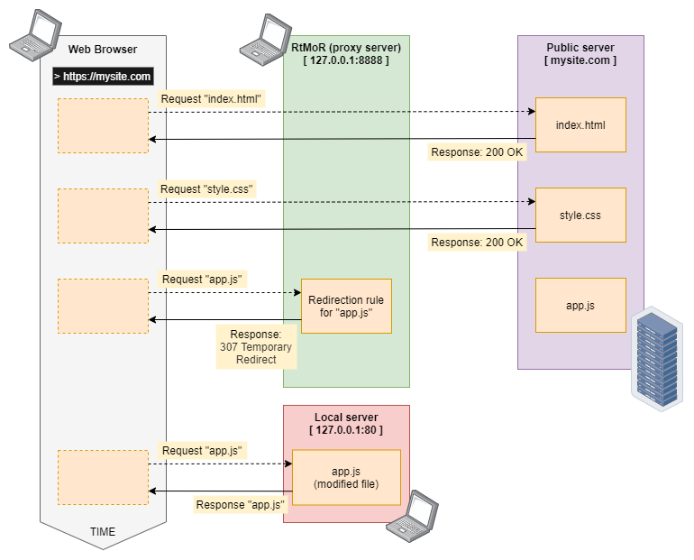

# RtMoR

_Real-time Modification of Requests_
- [github.com/Adrosar/rtmor](https://github.com/Adrosar/rtmor)
- [bitbucket.org/Adrosar/rtmor](https://bitbucket.org/Adrosar/rtmor)

**RtMoR** is alternative to **Requestly**
- [requestly.io](https://requestly.io) _(new website)_
- [www.requestly.in](https://www.requestly.in) _(old website)_


## Why do I need RtMoR?

If you are working on an application in **React**, **Angular**, **VueJS**, you will definitely appreciate **RtMoR**. See the problem below that **RtMoR** is solving.

### Issue (story):

You need to debug your JavaScript application in production. Unfortunately, you cannot make a copy of such an environment and nor can you access JS scripts on the server.

Thanks to **RtMoR**, you can redirect the selected resource request to the local server.



So you can **safely work** in the **production** environment.


## Examples (Linux, bash)

Remember to build a project!
```bash
./scripts/dist.sh
```

Show help:
```bash
./build/linux-amd64/rtmor -help
```

Run proxy server that is listening on all network interfaces:
```bash
./build/linux-amd64/rtmor -start -listen 0.0.0.0:8888 -log BMW
```

Run with a configuration containing sample rules:
```bash
./build/linux-amd64/rtmor -start -listen 0.0.0.0:8888 -cfg ./configs/sample.yaml -log BMW
```

### Configuration file

The configuration file contains examples of using **RtMoR** → `./configs/sample.yaml`


## Examples (Windows, cmd)

Run with a configuration containing sample rules:
```cmd
build\windows-amd64\rtmor.exe -start -listen 0.0.0.0:8888 -cfg configs\sample.yaml -log BMW
```


## HTTPS and Certificate

For HTTPS redirection to work, install the certificate on the device.
**CA Root:** `./vendor/github.com/elazarl/goproxy/ca.pem`


## Runnable binaries

[Download](https://drive.google.com/drive/folders/1K4XvLZYB10pQ1iTYsRh0FlLP_PzwhNp4?usp=sharing) a copy of the repository and **binaries** ready to run.


## License
I put the software temporarily under the Go-compatible **BSD** license. If this prevents someone from using the software, do let me know and I'll consider changing it.

The software uses repositories:

- [github.com/elazarl/goproxy](https://github.com/elazarl/goproxy) _(Go-compatible BSD license)_
- [github.com/go-yaml/yaml](https://github.com/go-yaml/yaml) _(Apache License 2.0)_
- [github.com/fatih/color](https://github.com/fatih/color) _(MIT License)_


## Early stage

The software was created for personal use and is in the **early stages** of development, so **CLI** is subject to change.


## Author

Adrian Gargula | [github.com/Adrosar](https://github.com/Adrosar) | [bitbucket.org/Adrosar](https://bitbucket.org/Adrosar)